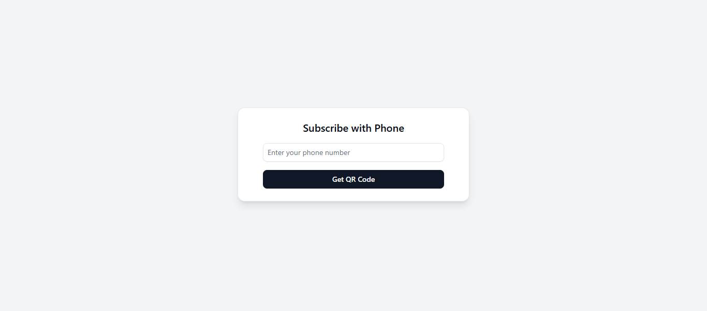

# Subscription Form

This is a Next.js project that implements a subscription form where users can enter their phone number and receive a QR code for confirmation. The form is fully responsive and built using **Tailwind CSS**.

## Features
- **Phone Number Validation**: Validates the phone number using a regex pattern.
- **QR Code Generation**: Generates a QR code for the entered phone number.
- **Loading State**: Displays a loading spinner while generating the QR code.
- **Responsive Design**: Built with Tailwind CSS for a fully responsive layout.

## Technologies Used
- **Next.js**: A React framework for server-side rendering and static site generation.
- **Tailwind CSS**: A utility-first CSS framework for styling.
- **Lucide React**: A library for icons in React.

## How to Run Locally

Follow these steps to run the project on your local machine:

1. **Clone the Repository**
   ```bash
   git clone https://github.com/shamimthedev/subscription-form.git
   cd subscription-form
   ```
2. **Install Dependencies**
   ```bash
   npm install
   ```
3. **Run the Development Server**
   ```bash
   npm run dev
   ```
4. **Open in Your Browser**
   Navigate to [http://localhost:3000](http://localhost:3000) to view the project.

## Project Structure
```
subscription-form/
├── src/
│   ├── app/
│   │   └── page.js          # Main page component
│   ├── components/
│   │   └── SubscriptionForm.jsx  # Subscription form component
│   └── styles/
│       └── globals.css      # Global styles
├── public/                  # Static assets
├── tailwind.config.js       # Tailwind CSS configuration
├── postcss.config.js        # PostCSS configuration
├── next.config.js           # Next.js configuration
└── README.md                # This file
```

## Requirements
- Node.js (v16 or higher)
- npm (v7 or higher)

## Dependencies
- next: ^13.0.0
- react: ^18.0.0
- react-dom: ^18.0.0
- tailwindcss: ^3.0.0
- lucide-react: ^0.100.0

## Deployment
This project can be easily deployed using Vercel:

1. Go to [Vercel](https://vercel.com/).
2. Import your GitHub repository.
3. Follow the steps to deploy your project.

Live Demo: [https://nova-subscription-form.vercel.app](https://nova-subscription-form.vercel.app)

## Screenshots


## License
This project is licensed under the MIT License. See the LICENSE file for details.

## Author
Md. Shamim Hossain

